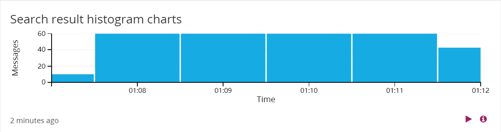
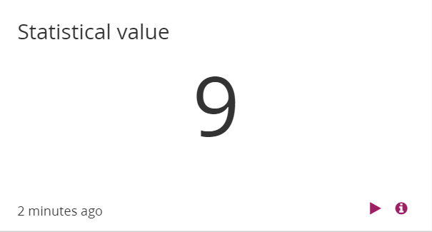
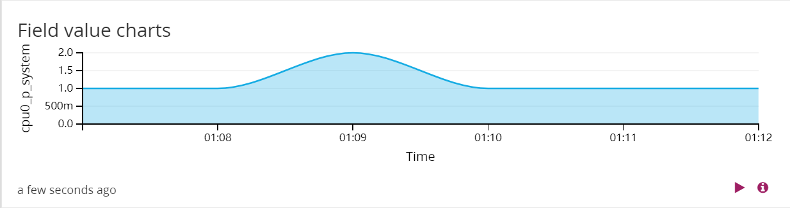
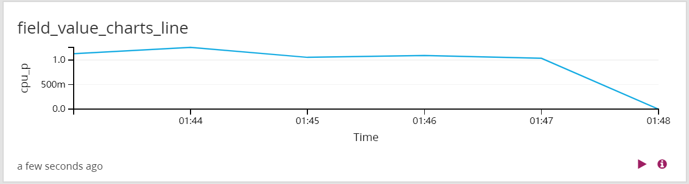
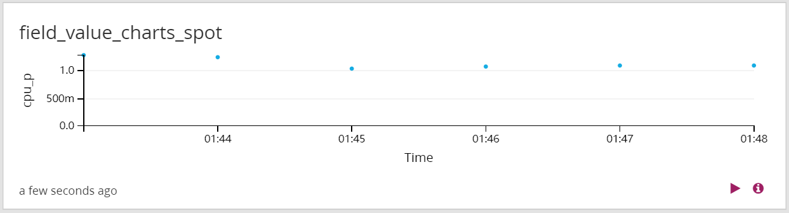
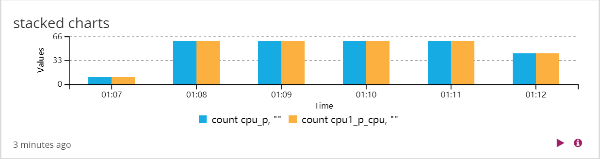
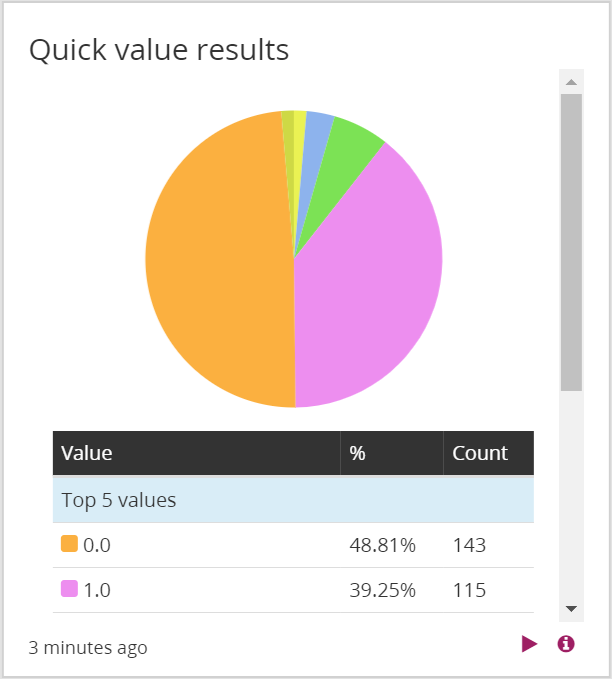

# graylog 部署说明
## 环境

mongo:4.1

graylog:2.4.6-1

elasticsearch: 5.6.10

## 配置

+ 信息收集与转发的流程为：

  fluent-bit收集cpu信息，将其转发给fluentd，接着fluentd将收到的消息转发给graylog。
  
  以收集cpu信息为例，以下涉及文件在graylog文件夹下

+ graylog.yml文件

  主要配置graylog的9000对应的端口，这个是网站的入口。

  其余的端口映射是graylog接收消息的端口

+ fluent-bit.yml文件

  主要配置fluent-bit收集信息的配置文件与容器内的文件对应

        volumes:
      - /var/:/var
      - ./config_fluent-bit/:/fluent-bit/etc/

+ fluentd.yml文件

  主要配置fluentd接收fluent-bit转发消息的监听端口与外部的映射关系

        ports:
      - 24224:24224
  外部端口24224与内部端口的映射

+ config_fluent-bit/fluent-bit.conf文件

  主要配置OUTPUT的输出方式与输出的host与port

      [OUTPUT]
        Name            forward
        Match           *
        Host            106.75.229.247
        Port            24224
  
  以上配置文件说明fluent-bit将收集到的cpu信息通过forward的方式转发给fluentd，转发的地址为106.75.229.247，端口为24224（容器外部端口）.

+ config_fluentd/fluent.conf文件

  主要配置fluentd从fluent-bit接收消息的端口与转发到graylog的host和端口，以及输出的type和协议（type和protocol与graylog系统中input的配置有关）

      <source>
        @type forward
        bind 0.0.0.0
        port 24224
      </source>
  
      <match **>
        @type gelf
        host 106.75.229.247
        port 5555
        protocol tcp
      </match>

  以上配置文件说明fluentd从24224（内部端口）接收以forward方式转发来的消息，并且以tcp协议发送到106.75.229.247的5555端口，且发送的数据格式为gelf。

+ 整个消息转发流程如下

  fluent-bit收集消息-->106.75.229.247:24224-->fluentd内部端口24224-->fluentd从内部端口24224接收到转发来的消息-->将消息发送到  106.75.229.247:5555-->graylog接收到消息（需要对input进行配置）

## 启动

+ 启动graylog 

      docker-compose -f graylog.yml up
 
+ 启动fluentd

      docker-compose -f fluentd.yml up
      
  
+ 启动fluent-bit
 
   这一步需要在graylog中添加了input以后进行，而且graylog的iniput监听端口应该与fluent-bit输出端口一致
 
      docker-compose -f fluent.yml up
  
  

## 系统说明

graylog中存在流的概念，相当于在消息到来时候，可以根据一些条件将消息分为不同的流中，并且可以指定某一个流的index。消息首先会经过all message这个stream，不管该message符合多少的stream条件，如果该message存储为default index的话，该message只会存储一次。但是如果该message所对应的index非default index，而且在配置时候 remove from all message未勾选，则该message会在es中存储多次。在访问控制，decorator和pipeline,alert 使用中都直接以流为单位。

+ 访问控制

  系统访问控制分为两个层次，role和user
  
  一个系统中有多个role，例如（admin，reader），每一个role下面有多个user。
  
  目前系统有admin和reader两个role，新建用于需要继承上面某一个role。reader对与stream和dashboard没有任何权限，所以新建role一般继承reader，在此基础上面增加权限。
  
  系统的权限以role为单位划分，每个role下的用户具有相同的权限，不能单独给用户赋予某个权限。
  
  role的权限分为两部分：stream的读写权限与dashboard的读写权限。
  
  stream的写权限主要包括管理该stream的rule。
  
  dashboard的写权限主要包括增加dashboard以及更改某个dashboard的参数。
  
  
+ 数据rotation与retention

  data rotation：
    
    以index为单位，系统允许某个index下的文章数目（或者大小，或者时间）超过某一阈值时候，将数据转到其他的索引上面。
    
  data retention：
    
    系统允许当某个index set中的index数目超过某一阈值以后对index采取什么行为，主要有三种：
    
    delete：删除时间早的index。
    
    close： close索引，以前的索引不再允许增加数据。
    
    do nothing： 什么都不做。
    
    archive：压缩以往数据（购买了才有这项功能）。

+ dashboard

  有一个widget cache time参数，这个参数将某一个widget的信息统计在glorylog-server中一段时间，这样就使得新加入节点不用重新计算已有的统计信息。
  
  
  在某一时间段内某个查询语句查询到的消息数量:
  
    
  
  
  某一个时间段内统计信息:
  
  
  
  
  并且这个图形能够显示变化趋势，并且指定上升或者下降为期望值（相应的趋势颜色会变成绿色，反之变为红色）:
  
    
  
  
  某一个时间段内某一个字段变化，可有bar，area，line，spot四种展示方式:
  
  
  
  
  
  
  
  
  
  
  
  多个图形可以叠加:
  
  
  
  
  
  某一段时间内某个字段出现的value的数量统计信息:
  
  
  
  
+ 异常值显示

  graylog中有stream的概念，可以新建一个stream，定义满足某个规则的为异常，查询该流变化情况，即可得到某个时间段内的异常情况。
  
  可以将异常的数据和正常的数据分别以柱状图显示，接着两个图合并，就能看到是否有异常情况了。
  

+ extractor:
   
  在graylog接收到消息时，这些消息可能不能被正确的解析，用户可以自定义规则来解析接收到的消息。
   
  （使用fluent-bit中es方法转发到graylog，graylog会将其解析为字符串，并且放到message字段中，可以使用extractor来解析这个json格式的字符串，使用fluentd方法转发直接就能够正确解析了，不需要再使用extractor）

+ pipeline
   
  与流关联，对某一个流中的消息首先经过一系列的rule来过滤，接着使用定义的action来对消息进行处理。
  
  action包括，改变某个字段的值，或者丢掉某个消息，改变字段格式，增加字段等。
  
  会对存储到es中的数据做出相应的更改

+ decorator
 
  在搜索的时候执行，任何改变不会对es中数据有影响,目的就是显示的时候可以个性化一点
   
  包括
  
  syslog security: graylog存储时默认有level字段，这个就可以将level的数字映射为alert，warn，error等
   
  format string：可以自定义字符串显示
   
  processing pipeline：可以通过pipeline来过滤某些信息
 
  lookup tables 从外部数据找到对应信息。
  
+ lookup tables

  可以从csv导入其他信息，例如可以根据某个ip地址通过lookup找到这个IP地址的地区。

+ alert
  
  
  alert仍是以流为单位来告警，alert包括两部分：配置告警condition和配置notification方式。其中condition与某一流关联而notification也与某一个流关联，满足了condition的消息会找到该流对应的notification，从而进行告警。
  
  支持两种警告方式，http和email。
  
  告警条件：message count：在过去一段时间内，某一消息的数量。
  
  field aggregation：在一段时间内，某一字段的统计结果是否超过了某一值。
  
  field content：某一字段为某值时进行alert。
  
  + email告警：
  
    需要更改配置文件graylog.conf，并且将其挂载到容器内的：/usr/share/graylog/data/config/graylog.conf 目录下。
  
    其中graylog.conf中需要更改的内容如下： 

        transport_email_enabled = true
        transport_email_hostname = smtp.163.com
        transport_email_port = 25
        transport_email_use_auth = true
        #transport_email_use_tls = true
        transport_email_use_ssl = false
        transport_email_auth_username = XX@163.com
        transport_email_auth_password = XX
        transport_email_subject_prefix = [graylog]
        #transport_email_from_email = graylog@example.com
      
     接着在graylog系统的alert页面增加condition和notification即可。
     
   + dingding 告警
   

  
