# 环境

mongo:4.1

graylog:2.4.6-1

elasticsearch: 5.6.10

fluent-bit:0.13

fluentd:1.2

# 收集数据


# 转发数据

因为fluent-bit的输出数据格式与graylog的输入数据格式不对应，所以使用了fluentd转发方法来将fluent-bit收集到的数据转发给graylog。

而且由于日志信息较多，如果fluentd与graylog使用TCP方式通信，存在fluentd与graylog保持太多TCP连接的问题，所以这里采用了UDP方式通信。fluentd使用插件tagged-udp，使得数据以UDP方式发送，graylog采用Raw/Plaintext UDP方式接收数据。

fluentd配置文件如下：

```
<source>
  @type forward
  bind 0.0.0.0
  port 5601

</source>

<match **>
  @type tagged_udp
  host 106.75.229.247
  port 5555
</match>
```

fluentd启动文件如下：

```
version: '2'
services:
   fluentd:
    image: fluent/fluentd-kubernetes-daemonset:debian-stable-graylog
    container_name: fluentd
    volumes:
      - ./config_fluentd/:/fluentd/etc/
    ports:
      - 5601:5601
```

即fluentd从5601（外部）端口接收数据，并且将数据以tagged-udp方式输出到106.75.229.247的5555端口。

graylog应从106.75.229.247的5555端口接收数据。


接着，启动fluent-bit，fluentd，graylog，mongo，elasticsearch即可。

graylog,mongo,elasticsearch启动文件graylog.yml如下

```
version: '2'
services:

  mongo:
    image: mongo:4.1
    container_name: mongo

  elasticsearch:
    image: elasticsearch:5.6.10
    container_name: elasticsearch
    environment:
      - http.host=0.0.0.0
      - xpack.security.enabled=false
      - elasticsearch_discovery_enabled=false

  graylog:
    image: graylog/graylog:2.4.6-1
    container_name: graylog
    environment:
      - GRAYLOG_WEB_ENDPOINT_URI=http://106.75.229.247:80/api
    ports:
      - 80:9000
      - 5555:5555/udp
    depends_on:
      - mongo
      - elasticsearch
    volumes:
      - ./graylog.conf:/usr/share/graylog/data/config/graylog.conf
SNAPSHOT.jar:/usr/share/graylog/plugin/telegram-alert-2.1.2-SNAPSHOT.jar
      - /home/jane/my_graylog_dingding/target/original-dingding-alert-2.1.2-SNAPSHOT.jar:/usr/share/graylog/plugin/original-dingding-alert-2.1.2-SNAPSHOT.jar
      - /home/jane/my_graylog_dingding/target/dingding-alert-2.1.2-SNAPSHOT.jar:/usr/share/graylog/plugin/dingding-alert-2.1.2-SNAPSHOT.jar
```

由配置文件可知，graylog的web页面在80端口，5555端口为接收数据端口。


# 接收数据

在fluentd，fluentd-bit，graylog，mongo，elasticsearch启动以后，需要配置graylog相关选项来接收和解析收集到的日志信息。

graylog以UDP格式接收fluentd转发来的数据，点击graylog系统中System/Input，进入input界面

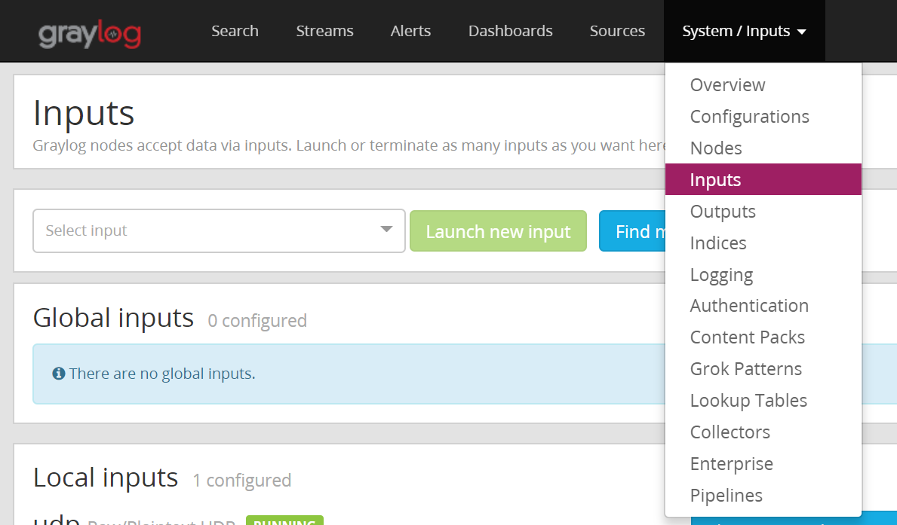


选择Raw/Plaintext UDP 点击Launch new input


在弹出的界面，配置Port（5555）即可。

这时，就能够接收fluentd转发来的消息了，从右上角的 In/Out msg/s的数字变化可以看到正在接收消息。

# 解析数据

在配置了input以后收到的数据是类似于如下格式的：

```

```


上述消息均存储在message字段中，如下图所示。

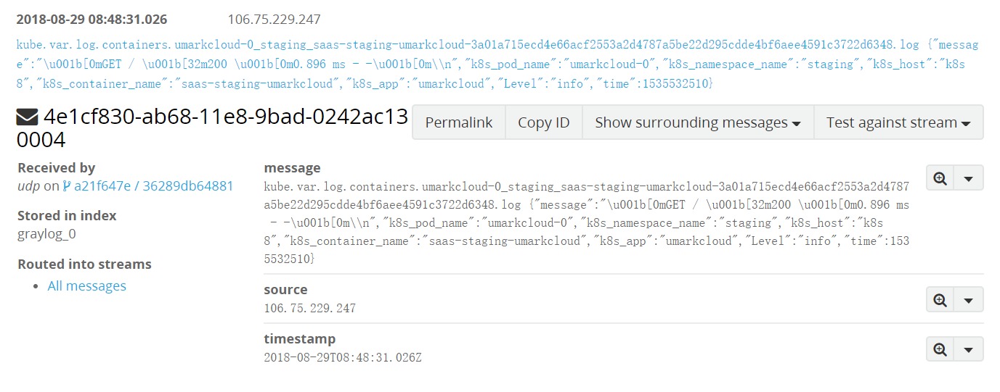

需要将该信息分成不同的字段存储并展示，以上述消息为例，希望处理后的结构为message，k8s_pod_name等字段。

处理分为两步：

+ 将数据处理成json格式
+ 解析json数据。 

## 将数据处理为json格式

因为有用的信息是在花括号中的json格式的数据，所以在将数据处理为json格式时候，只需要简单地删除花括号前面数据即可。

只需要为该字段新建extractor选择Replace with regular expression

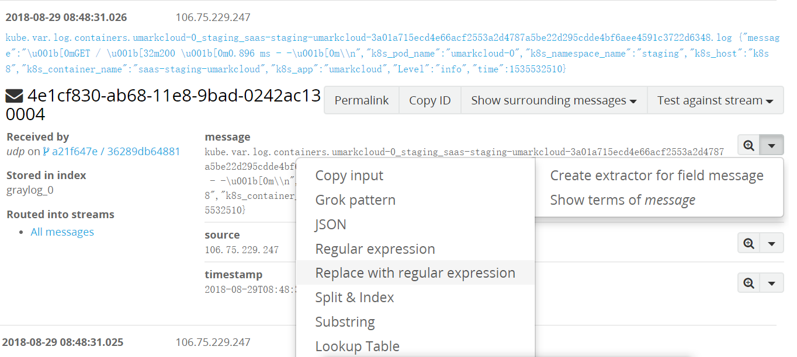


在新页面中填写正则表达式，以及替换的字符，将Store as field填为message，给该规则增添extractor title，接着点击Update extractor即可。

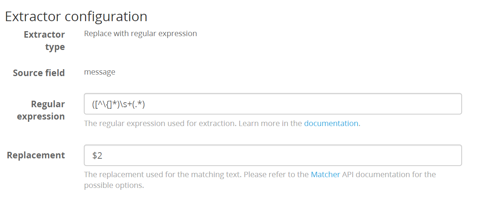

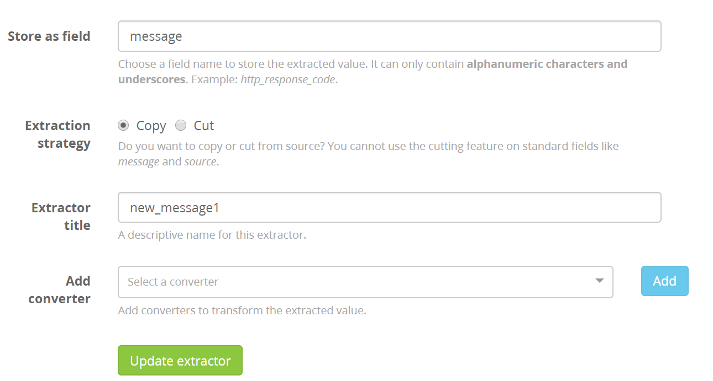

## 解析json数据

在将无用的信息删除保留json格式的有用信息以后，为message字段添加json extractor即可。


在新页面将Key/value separator一项改为：，接着给该extractor命名，接着点击Update extractor即可。

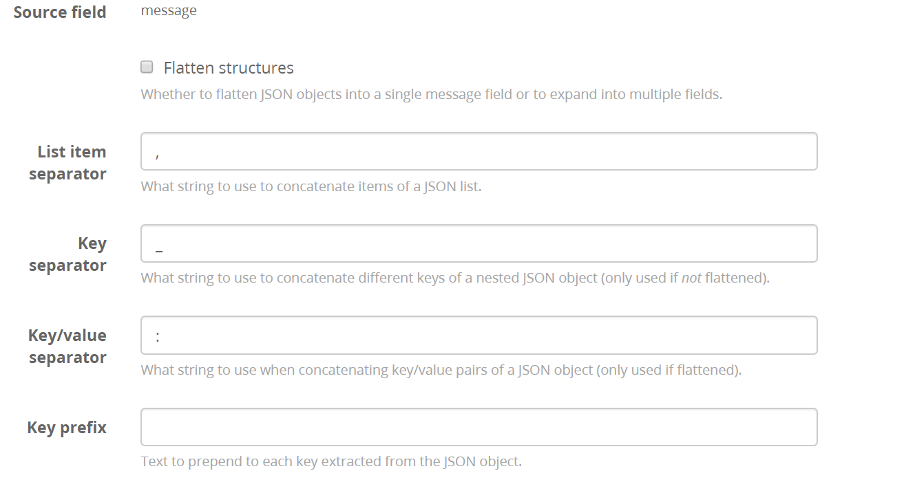

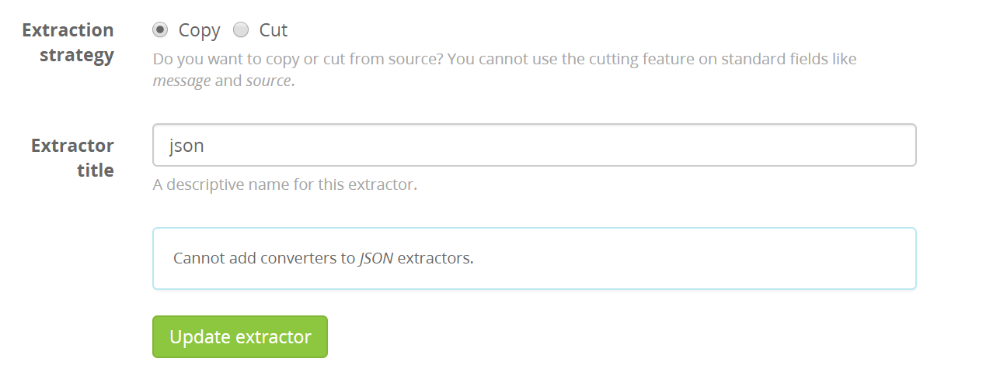


在经过这两步以后，消息格式如下所示：

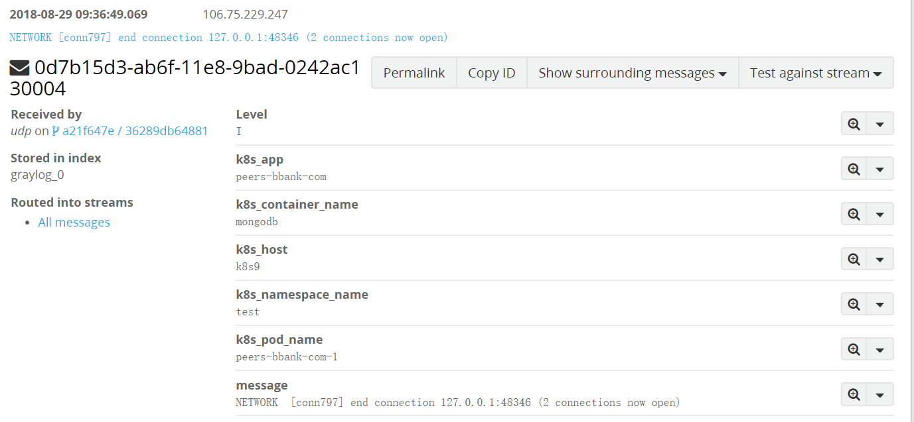


最后需要保证系统配置中Message Filter Chain 是active状态（也即允许系统使用extractor来解析字符串）

点击系统上方System/Configuration


在新打开页面中Message Processors Configuration一栏可以启用Message Filter chain

在下图中点击update

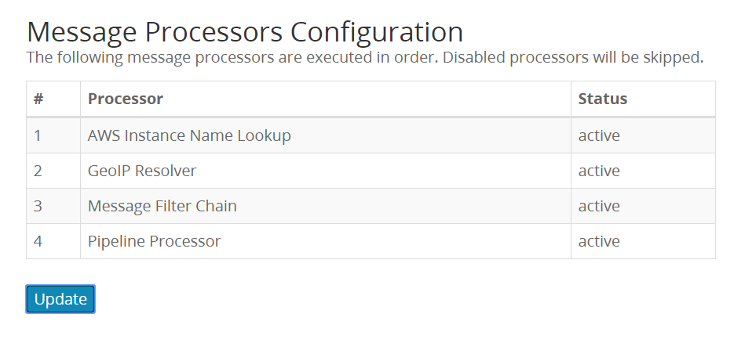

在新弹出页面启用Message Filter Chain

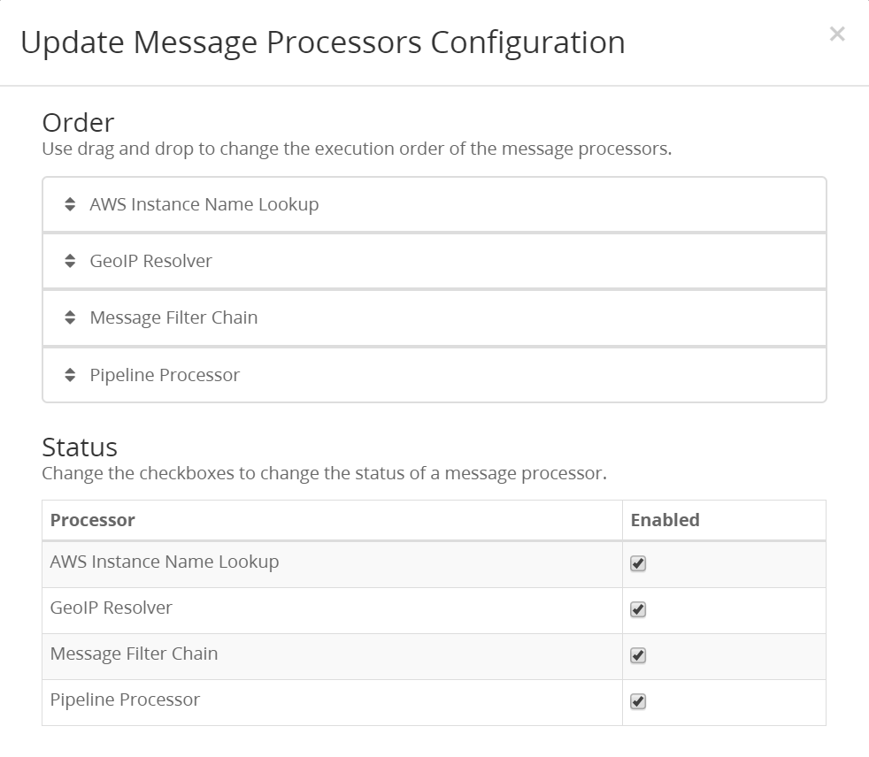


## 删除无用字段（optional）

在测试时候发现，在接收的消息中（最初存储在message字段中的消息）没有message这个键值，相反由log字段替代了message字段。那么这种情况下在按照上述步骤解析完json以后，会有log字段存储message信息，而message字段仍存储删去了开头无用信息后json格式的信息。

我们希望将message字段的内容替换为log字段的内容，并且删除log字段。

处理步骤为:

+ 将message字段替换为log字段的内容
+ 删除log字段。

### 将message字段替换为log字段的内容

需要给log字段添加Replace with regular expression形式的extractor

该字段extractor配置如下：

需要注意的是Regular expression，Replacement，和Store as field三项。

以下配置意思是将log中原本字符串仍保留原来格式，并且将替换后的字符串保存到message字段。

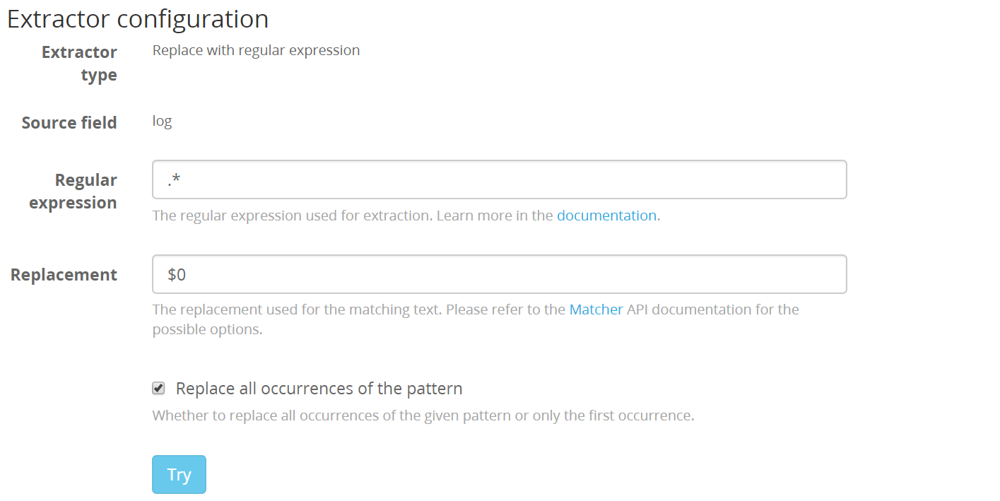


经过上述处理在System/Input/Manage Extractors页面，各个extractor的顺序如下：

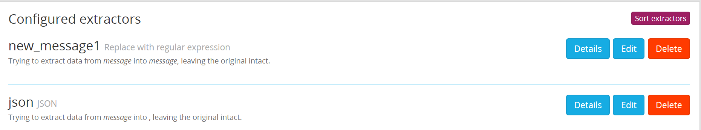

第一个extractor为删除无用字段extractor，第二个为解析json的extractor。

如果顺序有乱，点击Sort extractors重新排序即可。


### 删除log字段

在讲过上述步骤将message字段更改为log的内容以后，log字段仍然保留，这时需要将其删除。

使用pipeling将其删除即可。

点击系统上方System/Pipelines

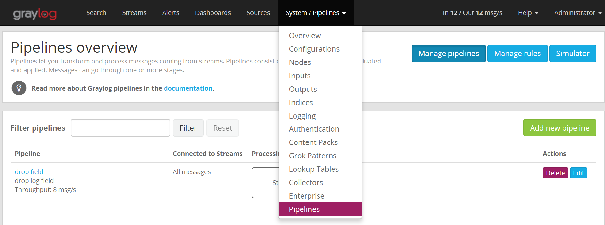


在新打开界面点击Manage rules

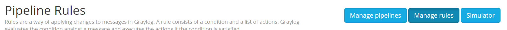


接着点击Create rules


在新打开页面中添加rule描述，并且添加Rule source，接着点击保存即可。

以下source代码意思为如果message中有"log"字段，那么删除该字段。

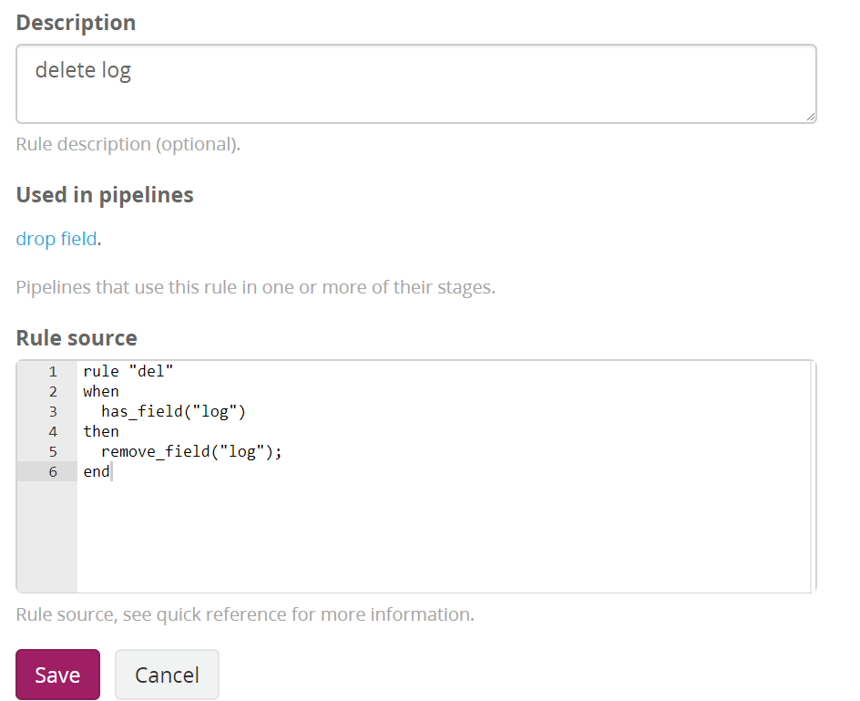


接着需要添加pipeline，将该rule和一个stream相关联。

点击 Manage Pipelines


新增pipeline，点击Add new pipeline

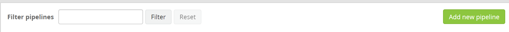

在新打开页面添加pipeline的title和描述，点击保存

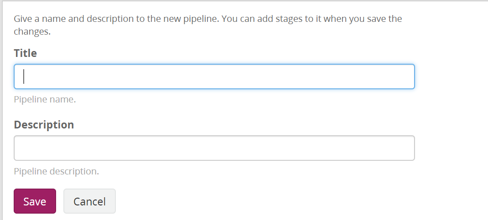


接着需要将该pipeline与一个stream和一个rule关联，点击该pipeline的edit选项：

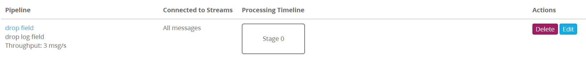

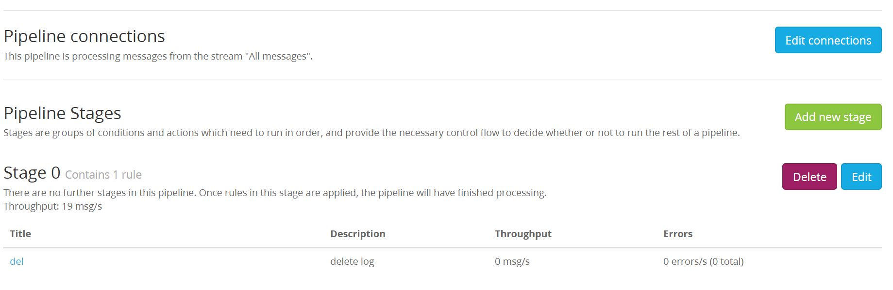

在新打开页面点击Edit connections，选择all stream流，并且保存。


接着需要关联规则，点击State0 的edit选项，在新打开界面添加上述步骤新建的规则，保存即可：

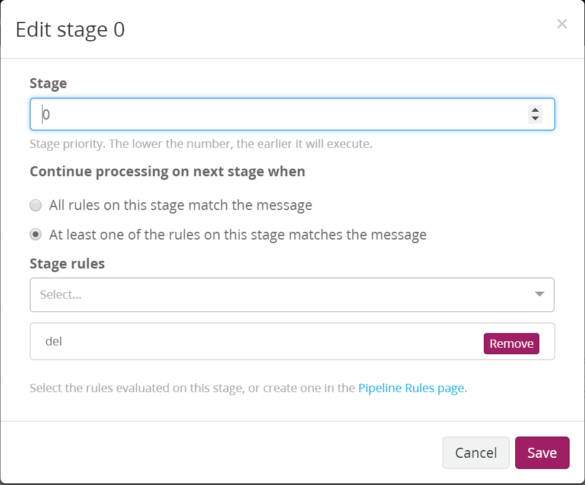


最后需要确保pipeline的处理在extractor的处理之后：

点击System/Configuration选项，在Message Processors Configuration 模块点击update更新Message Filter Chain选项在Pipeline Processor选项之前即可：


另外所有extractor的顺序如下：

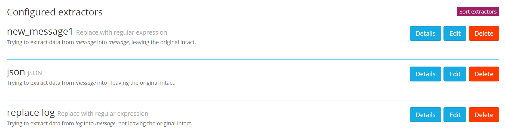

新增extractor为将message字段替换为log内容的extractor。

可点击Sort extractors进行排序（最终顺序需如上图）。


# 系统说明

graylog中存在流的概念，相当于在消息到来时候，可以根据一些条件将消息分为不同的流中，并且可以指定某一个流的index。消息首先会经过all message这个stream，不管该message符合多少的stream条件，如果该message存储为default index的话，该message只会存储一次。但是如果该message所对应的index非default index，而且在配置时候 remove from all message未勾选，则该message会在es中存储多次。在访问控制，decorator和pipeline,alert 使用中都直接以流为单位。

+ 访问控制

  系统访问控制分为两个层次，role和user

  一个系统中有多个role，例如（admin，reader），每一个role下面有多个user。

  目前系统有admin和reader两个role，新建用于需要继承上面某一个role。reader对与stream和dashboard没有任何权限，所以新建role一般继承reader，在此基础上面增加权限。

  系统的权限以role为单位划分，每个role下的用户具有相同的权限，不能单独给用户赋予某个权限。

  role的权限分为两部分：stream的读写权限与dashboard的读写权限。

  stream的写权限主要包括管理该stream的rule。

  dashboard的写权限主要包括增加dashboard以及更改某个dashboard的参数。

+ 数据rotation与retention

  data rotation：

    以index为单位，系统允许某个index下的文章数目（或者大小，或者时间）超过某一阈值时候，将数据转到其他的索引上面。

  data retention：

    系统允许当某个index set中的index数目超过某一阈值以后对index采取什么行为，主要有三种：

    delete：删除时间早的index。

    close： close索引，以前的索引不再允许增加数据。

    do nothing： 什么都不做。

    archive：压缩以往数据（购买了才有这项功能）。

+ dashboard

  有一个widget cache time参数，这个参数将某一个widget的信息统计在glorylog-server中一段时间，这样就使得新加入节点不用重新计算已有的统计信息。


  在某一时间段内某个查询语句查询到的消息数量:

    


  某一个时间段内统计信息:

  


  并且这个图形能够显示变化趋势，并且指定上升或者下降为期望值（相应的趋势颜色会变成绿色，反之变为红色）:

    


  某一个时间段内某一个字段变化，可有bar，area，line，spot四种展示方式:

  

  

  

  

  

  多个图形可以叠加:

  

  

  某一段时间内某个字段出现的value的数量统计信息:

  

+ 异常值显示

  graylog中有stream的概念，可以新建一个stream，定义满足某个规则的为异常，查询该流变化情况，即可得到某个时间段内的异常情况。

  可以将异常的数据和正常的数据分别以柱状图显示，接着两个图合并，就能看到是否有异常情况了。

+ extractor:

  在graylog接收到消息时，这些消息可能不能被正确的解析，用户可以自定义规则来解析接收到的消息。

  extractor有顺序，代表解析的顺序。

  （使用fluent-bit中es方法转发到graylog，graylog会将其解析为字符串，并且放到message字段中，可以使用extractor来解析这个json格式的字符串，使用fluentd方法转发直接就能够正确解析了，不需要再使用extractor）

+ pipeline

  与流关联，对某一个流中的消息首先经过一系列的rule来过滤，接着使用定义的action来对消息进行处理。

  action包括，改变某个字段的值，或者丢掉某个消息，改变字段格式，增加字段等。

  会对存储到es中的数据做出相应的更改


+ decorator

  在搜索的时候执行，任何改变不会对es中数据有影响,目的就是显示的时候可以个性化一点

  包括

  syslog security: graylog存储时默认有level字段，这个就可以将level的数字映射为alert，warn，error等

  format string：可以自定义字符串显示

  processing pipeline：可以通过pipeline来过滤某些信息

  lookup tables 从外部数据找到对应信息。

+ lookup tables

  可以从csv导入其他信息，例如可以根据某个ip地址通过lookup找到这个IP地址的地区。

+ alert


  alert仍是以流为单位来告警，alert包括两部分：配置告警condition和配置notification方式。其中condition与某一流关联而notification也与某一个流关联，满足了condition的消息会找到该流对应的notification，从而进行告警。

  支持两种警告方式，http和email。

  告警条件：
  > message count：在过去一段时间内，某一消息的数量。

  > field aggregation：在一段时间内，某一字段的统计结果是否超过了某一值。

  > field content：某一字段为某值时进行alert。

  一些condition的参数说明：

    默认graylog会每隔一分钟检查一次是否该告警条件还满足，如果仍然满足，根据Repeat notifications 是否勾选来选择是否继续报警，若勾选则报警，否则，不再报警。即便在每次检查时候发现有很多消息都满足告警条件，在每次检查后也只是最多发送一条消息。
    告警时间间隔由graylog.conf文件中的`alert_check_interval `决定。
    事实上，graylog似乎对从condition生成以来到当前时间每一条消息都检查一下其是否满足告警条件，接着以一分钟为单位来告警。

  + email告警：

    需要更改配置文件graylog.conf，并且将其挂载到容器内的：/usr/share/graylog/data/config/graylog.conf 目录下,如下所示。

             volumes:
          - ./graylog.conf:/usr/share/graylog/data/config/graylog.conf

    其中graylog.conf中需要更改的内容如下： 

        transport_email_enabled = true
        transport_email_hostname = smtp.163.com
        transport_email_port = 25
        transport_email_use_auth = true
        #transport_email_use_tls = true
        transport_email_use_ssl = false
        transport_email_auth_username = XX@163.com
        transport_email_auth_password = XX
        transport_email_subject_prefix = [graylog]
        #transport_email_from_email = graylog@example.com

     接着在graylog系统的alert页面增加condition和notification即可。

   + dingding 告警

     基于官网sample_plugin改写的插件，使用了telegram alert的一些配置。 telegram alert源码地址 ` https://github.com/irgendwr/TelegramAlert.git`

     改写后的源码地址：当前目录下的`./my_dingding_alert/`中，改写后生成的jar包在当前目录下的`./jar/`中。使用时需要将钉钉告警插件添加到graylog容器中。

     graylog.yml文件需要增加配置如下：

         volumes:
          - ./graylog.conf:/usr/share/graylog/data/config/graylog.conf
          - ./jar/original-dingding-alert-2.1.2-SNAPSHOT.jar:/usr/share/graylog/plugin/original-dingding-alert-2.1.2-SNAPSHOT.jar
          - ./jar/dingding-alert-2.1.2-SNAPSHOT.jar:/usr/share/graylog/plugin/dingding-alert-2.1.2-SNAPSHOT.jar

​              以上挂载jar包的目的地址为graylog容器的插件地址。

​              接着重启graylog，在新增notification的告警方式中选择Dingtalk Alert，并且添加相应的webhook地址即可。


  
